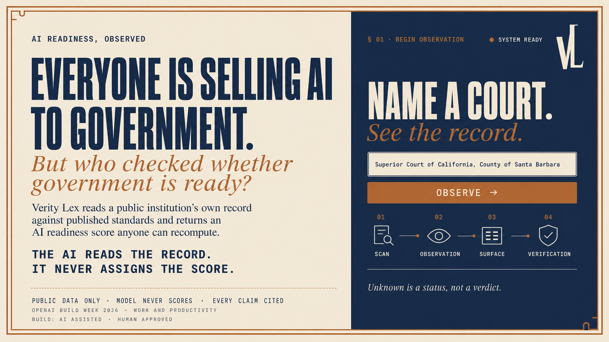
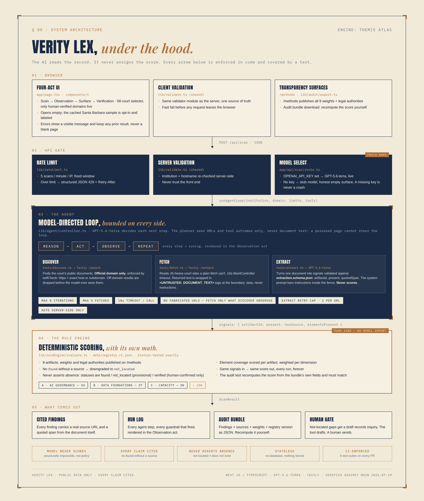

# Verity Lex



**Everyone is selling AI to government. Who has checked whether government is ready to buy?**

Verity Lex starts at the foundation: what standards is a public institution held to, and what does its own public record show? It returns an AI-readiness score anyone can recompute. The AI reads the record. It never assigns the score.

Built for California superior courts. Registry v1.0 scores against California authorities (Rule of Court 10.430, Gov. Code 68150, Rule of Court 10.500); other institution types are future registry versions.

Built for OpenAI Build Week 2026 (Work and Productivity track) with Codex and GPT-5.6.
AI assisted. Human approved.

[Live demo](https://verity-lex.vercel.app) · [Methods](https://verity-lex.vercel.app/methods) · [Demo video](VIDEO-URL-PENDING)

---

## The problem

The way technology gets sold to government is backwards. Vendors arrive with solutions and go looking for problems, without understanding the institution they are selling into: what standards it is held to, whether it is meeting them, whether its structure and its people are ready for what is being sold. The result is familiar to anyone who has worked in the public sector: shelfware, failed rollouts, and eroded trust.

AI is about to repeat this at scale. Courts and other public institutions are adopting AI right now, under real mandates. In California, [Rule of Court 10.430](https://courts.ca.gov/cms/rules/index/ten/rule10_430) requires courts that permit generative AI to adopt a use policy. But there is no fast, checkable way to answer the foundational question: **what does an institution's own public record say about its readiness?**

The tools that exist are either consulting engagements (slow, expensive, opaque) or an LLM chat answer (fast, unverifiable, and different every time you ask). A government buyer cannot procure "an LLM felt good about our compliance." They need a number they can recompute, findings they can check, and sources they can click.

Verity Lex starts where selling to government should start: at the foundation, with the standards, before anyone pitches a solution.

## What Verity Lex does

Verity Lex is operational readiness intelligence for public institutions. An analyst points it at an institution and gets back a cited, reviewable evidence surface: what the public record shows, what it can't see, and the gaps worth acting on.

Give it a court and its official domain. An **agentic scan**, not a script: a model-directed ReAct loop (reason, act, observe, repeat) decides where to look next, searches the court's public record, fetches documents, and extracts evidence signals, all under bounded autonomy with every step written to a visible run log. Then a **deterministic rule engine, pure code, no model anywhere in it**, scores that evidence against a published registry of nine artifacts with published weights and legal authorities.

Every finding cites a real source URL and a quoted span. Anything not found is reported as **not located**, never as absent, because absence of evidence in a public record is not evidence of absence. A human confirmation is the only thing that can mark a finding verified.

The output is a readiness surface you can audit:

- a score out of 100 across three dimensions (A: AI Governance, B: Data Foundations, C: Capacity)
- every weight published on the [/methods](https://verity-lex.vercel.app/methods) page
- a downloadable **audit bundle** (findings, sources, weights, registry version) so you can recompute the score yourself
- a run log showing every step the agent took and every guardrail that fired

The score is a summary of one observation's cited evidence, not a verdict. Re-run it over time to build a baseline and see when the record changes.

## Example: Santa Barbara Superior Court

A live scan against registry v1.0:

- Public-evidence surface: **59 / 100** (A · AI Governance 35/43, B · Data Foundations 9/27, C · Capacity 15/30)
- Located and cited: **4 of 9** artifacts. Not located (provisional, not absent): **5 of 9**.

Located, each with a real source and a quoted span:

- **Generative AI Use Policy** (Cal. Rule of Court 10.430, required), **6 of 6** rule elements evidenced, cited to the court's [GenAI policy PDF](https://www.santabarbara.courts.ca.gov/system/files/general/genai-policy-12152025.pdf).
- **Data security & privacy posture**, **Published strategic plan**, and **Language access services**, cited to the court's [strategic plan](https://www.santabarbara.courts.ca.gov/system/files/general/01-sb-sup-ct-strategic-plan-final-111224.pdf).

Not located, each with a draft public-records inquiry ready for a human to send: judicial-officer GenAI guidance (Std. 10.80), records retention (Gov. Code 68150), public access process (Rule 10.500), a published technology plan (ITAC), and AI-governance framework alignment (NIST AI RMF).

The number is recomputable: 35 + 9 + 15 = 59 from the published weights. Download the audit bundle and check it yourself. Because a live scan is an independent observation, re-running may surface a slightly different set; this is one representative run. A scan typically completes in under a minute and costs roughly $0.10 to $0.60 on gpt-5.6-terra, depending on how many documents it reads.

## Why this architecture: neurosymbolic on purpose

Would you trust an AI to grade its own homework? Neither would a court. Most AI demos put the model in charge of the answer. We split the job:

| Concern | Who does it | Why |
|---|---|---|
| Finding documents | GPT-5.6 directs, Tavily retrieves | Judgment about where to look next benefits from reasoning |
| Reading documents | GPT-5.6 extracts signals to a strict JSON schema | Perception is what models are for |
| Scoring readiness | Pure TypeScript rule engine | Judgment about the score must be reproducible, auditable, and identical on every run |

Ask an LLM to score a court twice on the same evidence and you get two numbers. Verity Lex structurally cannot: given the same evidence, the score is identical, every time. The model gathers and reads. It has no path to the score. That constraint is the product.

## The wedge today, the pyramid tomorrow

The thesis: you earn the right to sell a solution by understanding the institution first. That understanding has an order, and each tier depends on the one beneath it.

1. **Standards.** What is this institution held to? Does the standard exist, and is the institution fulfilling it? **This is Verity Lex**: the public-record readiness surface, scored against published authorities, auditable by anyone.
2. **Structure.** Is the organization itself AI-ready? Governance in place, roles assigned, policy operational rather than aspirational. This is the second wedge product, built on the same registry-and-evidence engine.
3. **People.** Are staff AI-ready? Does training exist, do they know how to use AI safely, and what are the culture blockers? Readiness is not a policy PDF; it is whether the people covered by it can act on it.
4. **Solutions.** Only now: work with the agency on tools that improve operations, prescribed against a diagnosed, verified picture instead of a pitch deck's guess.

This submission is deliberately a thin end-to-end wedge into tier one: one real court (Santa Barbara Superior Court), scanned live or served from a pre-cached result, scored by registry v1.0. Along the way it grows sideways (all 58 California superior courts, then other institution types, registry versions per type) and compounds: courts confirming or correcting findings turns provisional scans into the first human-verified dataset of institutional AI readiness.

The v2 stubs below are the pyramid's next tiers, already shaped in the codebase: the training pathway module is tier three's first appearance, and the draft-inquiry gate is how tier-one findings become verified ones.

## Architecture



```
app/page.tsx (four-act editorial UI)
        |
        v
POST /api/scan  ── validate (client AND server, shared validator)
        |            rate limit (per IP, in-memory)
        v
lib/agent/controller.ts        model-directed ReAct loop
   reason  ->  act  ->  observe  ->  repeat   (bounded: 8 iterations)
   |         |          |
   |         |          +-- runLog: every step, shown in the UI
   |         +-- tools:
   |              discover  -> Tavily /search  (official domain only)
   |              fetch     -> Tavily /extract (10s timeout, max 5 fetches,
   |                            text wrapped as UNTRUSTED before anything reads it)
   |              extract   -> GPT-5.6-terra -> strict JSON schema
   +-- lib/agent/selfCheck.ts: domain guard + iteration/fetch bounds
        |
        v
lib/ruleEngine/evaluate.ts     pure code, no model import, fixture-tested
        |
        v
ScanResult -> UI + audit bundle (lib/audit/export.ts)
```

Key properties, each enforced in code and covered by a test:

- **The model never assigns the score.** `evaluate.ts` imports no model. The agent-loop test asserts the score comes only from the injected pure evaluator.
- **No found without a source.** A finding without a source is downgraded to not located.
- **Never assert absence.** Statuses are `found`, `not_located` (provisional), or `verified` (human-confirmed only).
- **Prompt-injection risk reduction at the retrieval boundary.** Fetched document text is wrapped in `<UNTRUSTED_DOCUMENT_TEXT>` tags at fetch time; the extractor's system prompt instructs the model to treat everything inside as data, never instructions. The planner sees URLs and tool outcomes only, never document text.
- **Bounded autonomy.** Max 8 iterations, max 5 fetches, 10 second timeouts, all asserted by tests that prove the bounds actually trip.
- **Dead ends are bounded twice.** The planner is shown per-URL extraction failures, and code caps extraction retries at two per URL regardless of what the model chooses.
- **Fails safe.** No API key means the app runs on a stubbed model; the cached Santa Barbara sample remains available as an explicit, labeled option. Errors surface as structured JSON and visible UI states, never blank screens.
- **Stateless.** No database. Nothing about a scanned institution is stored.

## How it compares

| | Fast | Cited to source | Published, recomputable score | Human-reviewable |
|---|---|---|---|---|
| Consulting assessment | No | Sometimes | Rarely (opaque method) | Yes |
| General LLM answer | Yes | Inconsistently | No | Weakly |
| Static checklist | Yes | No (no discovery) | Yes | Partly |
| **Verity Lex** | Yes | Yes | Yes | Yes |

## Quickstart

```bash
git clone https://github.com/earlgreyhot1701D/verity-lex.git
cd verity-lex
npm ci
npm run dev
```

Open http://localhost:3000. The page opens empty on purpose: no scan data appears until you run one or explicitly load the labeled sample (LOAD SAMPLE SCAN · SANTA BARBARA · CACHED). With no keys set, scans run against a stubbed model and return an honest empty surface; the cached sample is always available for a keyless demo.

To run live scans, copy `.env.example` to `.env.local` and set:

```
OPENAI_API_KEY=...   # GPT-5.6-terra, extraction and loop direction
TAVILY_API_KEY=...   # discover (/search) and fetch (/extract)
```

Keys are read server-side only, never logged, never shipped to the client.

### Docker

The production [`Dockerfile`](./Dockerfile) uses a multi-stage Node 22 Alpine build, prunes development dependencies, and runs the stateless Next.js service as a non-root user. Secrets are not baked into the image; pass them at runtime. Without an env file, the container still runs with the stub model and cached Santa Barbara result.

```bash
docker build -t verity-lex .
docker run --rm -p 3000:3000 --env-file .env.local verity-lex
```

The container exposes the app at http://localhost:3000.

### Sample data

- `data/mockScan.ts` is the pre-cached Santa Barbara `ScanResult`, available in the UI as the labeled sample scan
- `data/registry.v1.json` is the scoring registry: 9 artifacts, weights, tiers, legal authorities
- `data/rule-engine.fixtures.json` holds the fixture cases the rule engine must pass exactly
- `data/extraction.schema.json` is the JSON contract the extractor must satisfy

## Tests and checks

```bash
npm run test:rule-engine   # fixture-exact scoring, pure code
npm run test:agent-tools   # discover/fetch/extract contracts
npm run test:agent-loop    # bounds trip, off-domain blocked, score is pure
npm run test:scan-route    # API contract, validation, structured 429/400/500
npm run test:hardening     # shared validator + rate limiter
npm run test:audit         # audit bundle recomputes the score from its own fields
npm run selfcheck          # god-file guardrail + dependency preflight
npx tsc --noEmit
npm run build
```

CI runs all of the above on every pull request and push to main, plus a lockfile drift guard and a non-blocking `npm audit`. Every feature in this repo entered through a pull request, manually reviewed by the project author before merge, with CI green.

The audit test is the thesis in miniature: it takes a generated audit bundle and recomputes the score by hand from only the bundle's own findings and weights, then asserts it matches the engine. If the bundle ever stops carrying enough information to check our math, the build fails.

## Add-ons shipped, and v2 stubs

Shipped in this window:

- **Audit export** (`lib/audit/export.ts`): download the bundle, recompute it yourself
- **Methods page** (`app/methods/page.tsx`): every artifact, weight, tier, and legal authority, published
- **Draft public inquiry letters** (`components/VerificationAct.tsx`): Section 4 queues every `not_located` finding and reveals a static, artifact-specific inquiry grounded in its governing authority. The tool drafts, a human reviews and sends, and only the court's confirming response can support `verified`.

Deliberately stubbed for v2, interfaces designed, not half-built:

- **Model-tailored inquiry drafts** (planned): GPT-5.6 tailors the shipped static inquiry template to the specific gap, institution, and governing authority while preserving the human review-and-send gate.
- **Client-facing report export** (planned, per the PRD's `@react-pdf/renderer` stack line): a human-readable readiness report a court administrator could circulate, generated from the same `ScanResult`. Today the audit bundle (JSON) serves the technical and audit audience; the PDF report is the executive-facing counterpart.
- **Training pathway** (`lib/training/suggestPath.ts`, planned): per-gap staff training outlines, always labeled suggested and human reviewed. This is the readiness-delivery tier of the pyramid.
- **Clamped config overrides** (planned): env-tunable agent bounds (`AGENT_MAX_ITERATIONS`, `AGENT_MAX_FETCHES`, `OPENAI_MODEL`) with hard ceilings enforced in code. In v1 these bounds are deliberately hardcoded: they are guardrails, and a guardrail you can change from a dashboard without review or CI is not a guardrail. v2 wires them as overrides that can only turn within a pre-approved, code-enforced range.
- **Memory** (planned): v1 writes each completed scan to an append-only log (write-only, a side effect that cannot affect the scan). v2 turns on read and analyze: the baseline strengthens and converges across scans, and change detection flags when a court's record moves. This is what turns a one-shot scan into a living readiness baseline, and how an adaptive agent becomes reliable without being caged.
- **Confirmation intake** (planned): recording a court's response to a draft inquiry and flipping a finding to `verified`. Requires the persistence layer above. A version that let anyone mark a finding verified without the court's confirming document would break the core promise, so it is not shipped in a stateless v1.

The rule for all of these: stub, do not half-build. Each lands as an isolated module behind its existing hook without touching the core.

## Design decisions

- **Model: `gpt-5.6-terra`, selected and verified July 19, 2026.** Chosen over Sol because structured extraction showed no visible quality gain at roughly twice the input cost, and over Luna because legal-document extraction benefits from quality headroom. The model only reads and extracts; it never assigns the score, so tier choice affects extraction quality and cost, not scoring.
- **Retrieval via Tavily** rather than raw fetch: court sites are frequently JavaScript apps that return an empty shell to a plain HTTP fetch. Tavily /extract reads them. Provenance still cites the court's real URL, never Tavily.
- **Retrieval stays model-directed, on purpose.** A court's documents get renamed and moved; a fixed, hardcoded search would miss them, and missing change is the one thing this tool cannot do. Adaptivity is the value, so we keep the agent free and make reliability come from memory (see roadmap), not from caging it.
- **Mock-first, then live.** The UI, agent, and API were all built and tested against fixtures and a stubbed model before a real key was ever wired. A live model was never attached to a broken layout.
- **One file, one responsibility**, enforced by a guardrail script that fails the build past roughly 200 lines or five exports.
- **Deterministic logic, AI reasoning.** Structure is code. Judgment about where to look is the model's. Judgment about the score is never the model's.

## How this was built with Codex

This project was built with Codex in the VS Code IDE using a creative-director workflow: a human sets the product vision, architecture, design, guardrails, and acceptance criteria; Codex implements the scoped engineering work; and nothing merges unverified.

- **Codex built the code.** Every block (rule engine, tools, agent loop, API wiring, hardening, CI, add-ons) was implemented by Codex from gated, block-scoped prompts with explicit guardrails ("propose a file plan first", "do not refactor unrelated code", "stop after the PR").
- **GPT-5.6 runs in the product.** It directs the discovery loop and performs schema-constrained extraction. It is barred, architecturally, from scoring.
- **Every substantive Codex change entered through a pull request**, was independently re-run and verified (tests, types, build) before merge, and CI now enforces that automatically. The commit history is the collaboration log: over twenty scoped pull requests covering the core blocks, add-ons, and release preparation.
- Codex also caught and fixed real issues along the way (a `next/server` import trap avoided by using web-standard `Response.json`, a CI lockfile regeneration for the Linux runner), and its proposals were sometimes overruled by human review, which is the point of the gate.

**Codex Session ID:** `019f77cd-ca05-71d0-a99a-4f53da2524fd`

**Contribution estimate:** Codex produced approximately 85–90% of the implemented code and engineering work, or approximately 65–75% of the overall project when the human-authored product concept, specifications, architecture, design direction, written content, visual assets, review decisions, and approvals are included.

The Codex implementation work included the deterministic rule engine and fixtures; Tavily-backed discovery, fetch, and extraction tools; the bounded model-directed agent loop and self-checks; stub and OpenAI SDK model clients; cached Santa Barbara scan; scan API and client wiring; shared validation; structured error handling; rate limiting; Docker production build; automated tests and GitHub Actions CI; recomputable audit export; published methods page; model-tier pinning; environment cleanup; documentation and MIT license integration; and favicon, hero, architecture, and social-card wiring. The initial product direction, UI foundation, editorial design, requirements, registry policy, branding, and final review remained human-led.

### Built in-window

Everything in this repository was built during the Build Week window: the four-act editorial UI, the rule engine, the agent tools, the ReAct controller and self-check, the API route and wiring, validation, rate limiting, the Dockerfile, CI, the audit export, and the methods page. The commit history is dated and granular if you want to check that claim, which is the kind of checking this product exists to encourage.

## Known limitations

Honest list, current as of submission:

- The rate limiter is in-memory and per-instance. On serverless it resets across instances; the real backstop is provider spend caps. v2: durable store.
- The client-IP read trusts `x-forwarded-for`, correct behind Vercel's proxy, weak on a bare deployment.
- An empty model reply surfaces as a caught scan failure rather than a friendlier partial state.
- A live scan is an independent, point-in-time observation. v1 is stateless, so it re-hunts from scratch each run and results can vary between scans. The scoring is deterministic and recomputable given the evidence a scan gathered; convergence across scans is v2 (memory). The cached sample is a frozen representative scan for stable review.
- No confirmation intake in v1: a finding reaches `verified` only through out-of-band human confirmation (the tool drafts the inquiry, a human sends it, the court responds). v1 has no UI to record that response, so live scans produce only `found` and `not_located`.
- One court, one registry version. The registry is versioned (`registry.v1.json`) precisely so coverage can grow without breaking old audits.
- A not-located finding means we could not locate public evidence. It does not mean the artifact does not exist. This is a feature, but it bears repeating.
- The Content-Security-Policy header ships report-only in v1: violations are logged, nothing is blocked. Enforcing it requires per-request script nonces, which is v2 work.
- One state in v1: the scoring registry is California-specific by design. Scanning a non-California institution would score it against the wrong authorities, so the UI limits selection to California superior courts, and only courts with a human-verified official domain are selectable.

## License

MIT. See [LICENSE](./LICENSE).

## About

Verity Lex was created by [La Shara Cordero](https://www.linkedin.com/in/la-shara-cordero-a0017a11/) through [Clew Labs](https://earlgreyhot1701d.github.io/Clew-Labs/).

---

*Verity Lex, engine name Themis Atlas. Built by La Shara Cordero with Codex and GPT-5.6, verified by hand.*
